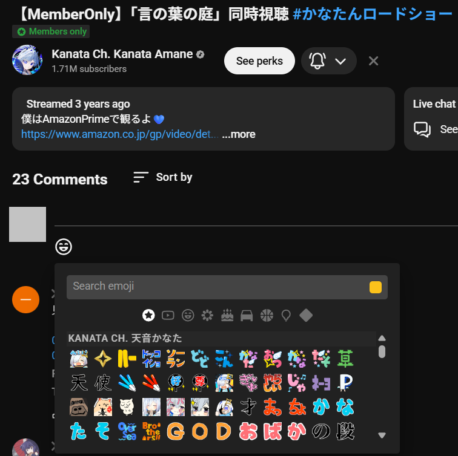
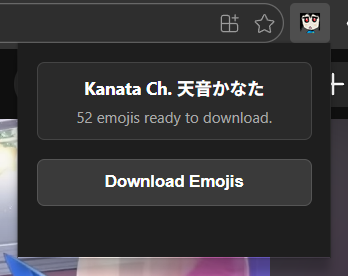

# Emoji-Packed

> Simple chrome extension to download Youtube Channel Custom Emojis (with their names) 🎉⭐🪽

## Installation

1. Clone this project, or download and extract folder
2. Go to extension page (e.g. `edge://extensions/` for Microsoft Edge)
3. Click  `Load unpacked` and select this project folder

## Usage

1. Open your target Youtube channel's video (any video will do)
2. Navigate to the comment section. Click on the emoji picker button.
   
3. Click on Emoji-Packed extension icon. If custom emojis have been found, the `Download Emojis` button should be clickable.
   

## IMPORTANT

Just because you can easily grab the images doesn't mean they can be used freely. Please respect the original owner and beware of the copyright Infringement. And your moral, please keep it high.
